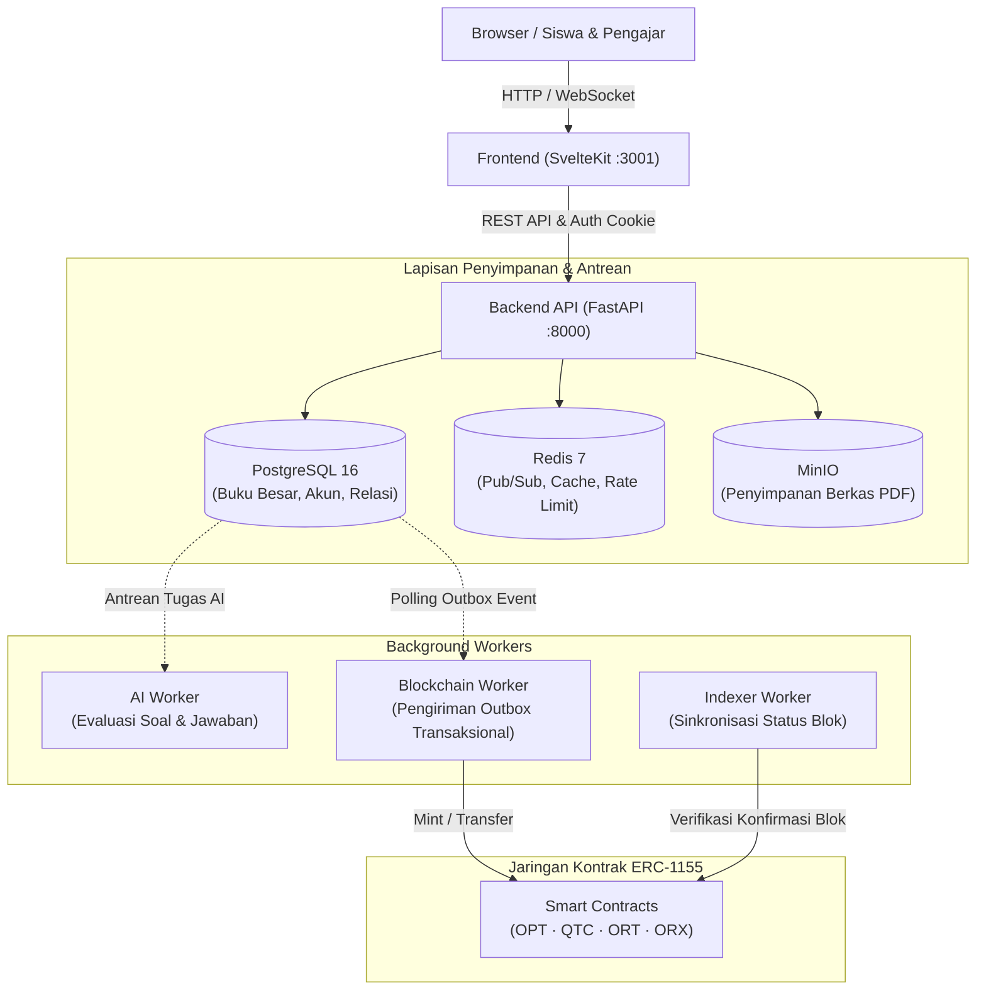

# QLoot

> Platform e-learning berbasis kelas bergamifikasi dengan ujian berbantuan AI, ruang kompetisi real-time, quest dan peringkat, serta sistem reward Web3 melalui OryphemToken (OPT) ERC-1155.

QLoot memadukan pengalaman belajar modern ala sekolah digital dengan simulasi aset Web3 dan kecerdasan buatan. Dibangun sebagai monorepo berbasis **FastAPI + SvelteKit** dengan transaksi database ACID, kontrol akses berbasis peran (RBAC) pada level objek, outbox transaksional, dan background worker yang handal.

> [!NOTE]
> Seluruh platform dirancang dengan prinsip **deterministic simulation**: provider AI secara default menggunakan mock cerdas, client blockchain berjalan dalam mode `dry_run`, dan modul panduan karier disimulasikan penuh. Platform dapat langsung dijalankan, didemokan, dan diuji secara offline tanpa ketergantungan API key eksternal.

---

## Daftar Isi

- [Tentang QLoot](#tentang-qloot)
- [Fitur Utama](#fitur-utama)
- [Tech Stack](#tech-stack)
- [Arsitektur Sistem](#arsitektur-sistem)
- [Struktur Repositori](#struktur-repositori)
- [Mulai Cepat](#mulai-cepat)
- [Daftar Rute dan Layanan](#daftar-rute-dan-layanan)
- [Alur Penggunaan dan Akun Demo](#alur-penggunaan-dan-akun-demo)
- [Konfigurasi Environment](#konfigurasi-environment)
- [Blockchain dan OryphemToken (OPT)](#blockchain-dan-oryphemtoken-opt)
- [Integrasi AI Gateway](#integrasi-ai-gateway)
- [Pengujian](#pengujian)
- [Pemecahan Masalah](#pemecahan-masalah)
- [Keamanan](#keamanan)
- [Lisensi](#lisensi)

---

## Tentang QLoot

QLoot memodelkan ekosistem pembelajaran sekolah digital yang terstruktur:

- **Guru (Teacher)** membuat pelajaran yang ditargetkan untuk kelas tertentu (misal: `Kelas 1 · IPA`), mengunggah materi pelajaran (PDF), menyusun ujian (pilihan ganda maupun esai), merancang quest dan ruang kompetisi, serta memberikan tugas.
- **Siswa (Student)** terdaftar pada kelas tertentu dan otomatis mendapatkan kurikulum serta pelajaran yang relevan dengan kelasnya. Siswa belajar materi, mengikuti ujian berbatas waktu, menyelesaikan quest dan tugas, serta mengumpulkan token **OPT** sebagai apresiasi belajar.
- **Admin** mengawasi operasional platform, memantau rekonsiliasi buku besar (ledger), mengelola pengguna dan moderasi komunitas, serta mengontrol parameter blockchain.

Setiap pencapaian belajar dicatat ke dalam **buku besar double-entry (kustodial)** yang transaksional. Event reward diterbitkan lewat tabel outbox, diproses oleh background worker, dan disinkronkan ke smart contract ERC-1155.

---

## Fitur Utama

- **Pembelajaran Berbasis Kelas**: Pelajaran tertarget per-kelas dan jurusan (IPA/IPS). Dilengkapi pelacakan kemajuan belajar per-materi, penanda kelulusan, dan penerbitan sertifikat digital otomatis saat menyelesaikan seluruh modul.
- **Ujian dan Evaluasi Berbantuan AI**: Ujian berbatas waktu otoritatif dari server dengan fitur autosave dan pengumpulan idempoten. Soal pilihan ganda dinilai secara instan, sedangkan esai dievaluasi oleh asisten AI dengan umpan balik terstruktur dan skor kemiripan.
- **Gamifikasi dan Ruang Kompetisi**: Ruang kompetisi live dengan kehadiran dan papan peringkat real-time berbasis WebSocket. Quest kompetitif deterministik (*fastest-valid winner*), tugas berkala, sistem lencana (badge), serta perhitungan XP dan level transparan.
- **Panduan Karier Digital**: Asesmen kepribadian Big Five, rekomendasi jurusan AI dengan verifikasi guru BK (*human-in-the-loop*), peta jalan (*roadmap*) pencapaian, ruang konsultasi BK, dan asisten belajar interaktif **Asisten Qlo**.
- **Reward Web3 dan Dompet Kustodial**: Saldo terfokus per-pengguna dengan pencatatan buku besar (*double-entry ledger*). Dukungan penarikan (*withdrawal*) ke dompet Web3 pribadi (seperti MetaMask), penukaran aset via router OryphemProxy (ORX), dan audit rekonsiliasi saldo.
- **Panel Khusus Guru dan Admin**: Antarmuka terpisah dengan perlindungan peran (*role guard*). Panel Guru untuk manajemen materi, bank soal, hasil ujian, dan evaluasi siswa. Panel Admin untuk audit sistem, rekonsiliasi buku besar, siaran notifikasi, dan kontrol operasional blockchain.

---

## Tech Stack

| Lapisan | Teknologi | Keterangan |
|---|---|---|
| **Backend API** | Python 3.11+, FastAPI 0.115+, Pydantic v2 | Arsitektur async, validasi skema ketat |
| **Database & ORM** | PostgreSQL 16, SQLAlchemy 2 (async), asyncpg, Alembic | Transaksi ACID, isolasi multi-tenant |
| **Cache & Pub/Sub** | Redis 7 | Antrean pesan outbox, WebSocket presence, rate limiting |
| **Penyimpanan Berkas** | MinIO / Local Object Storage | Unggah materi pelajaran dan aset PDF |
| **Frontend Web** | SvelteKit 2, Svelte 5, TypeScript, Vite 5, Tailwind CSS 3 | Mode SSR + SPA, desain responsif, tema gelap/terang |
| **Kontrak Blockchain** | Solidity 0.8+, Hardhat, OpenZeppelin Contracts (UUPS) | Standar multi-token ERC-1155 upgradeable |
| **Web3 Client** | Web3.py, eth-account, Ethers.js | Transaksi on-chain, penandatanganan payload aman |
| **Worker & Antrean** | Background workers independen (`ai`, `blockchain`, `indexer`) | Pola `SELECT ... FOR UPDATE SKIP LOCKED` |
| **Tooling & Uji** | pytest, pytest-asyncio, Vitest, Playwright, Docker Compose | Pengujian unit, integrasi, kontrak, dan end-to-end |

---

## Arsitektur Sistem

QLoot memisahkan tanggung jawab antara antarmuka pengguna, server aplikasi, antrean terdistribusi, dan lapisan kontrak terdesentralisasi:



Aliran data dari pencapaian belajar menuju saldo:
1. Siswa menyelesaikan tugas atau ujian dengan hasil valid.
2. `RewardEngine` menyimpan reward ke tabel `reward_allocations`, memperbarui saldo di `wallet_ledger_entries`, dan membuat catatan di `transaction_outbox` dalam **satu transaksi database**.
3. Background worker membaca event outbox yang belum diproses dan mengirimkan batch transaksi ke node blockchain.
4. Indexer memantau konfirmasi blok pada jaringan dan memperbarui status transaksi menjadi terkonfirmasi (*confirmed*).

---

## Struktur Repositori

```
qloot/
├── apps/
│   ├── backend/           # Layanan API FastAPI, model database, worker, dan migrasi Alembic
│   │   ├── app/           # Sumber kode backend (api, core, models, services, ai, db)
│   │   ├── migrations/    # Berkas migrasi database Alembic
│   │   └── tests/         # Rangkaian pengujian unit dan integrasi pytest
│   └── frontend/          # Aplikasi web SvelteKit, komponen antarmuka, dan rute
│       ├── src/           # Komponen Svelte 5, pustaka helper, store otentikasi
│       └── tests/         # Pengujian Vitest dan Playwright
├── blockchain/            # Proyek Hardhat, smart contracts Solidity ERC-1155, dan skrip deploy
│   ├── contracts/         # Kode kontrak (OryphemToken, QlootChain, OryphemIntelligence, ORX)
│   ├── scripts/           # Skrip deployment dan interaksi jaringan
│   └── test/              # Rangkaian pengujian kontrak Solidity
├── docs/                  # Dokumentasi teknis mendalam (arsitektur, api, blockchain, runbook, security)
├── infrastructure/        # Konfigurasi proxy, monitoring Prometheus/Grafana, dan template server
├── scripts/               # Utilitas pengembang (pemeriksaan environment, skrip skenario e2e)
├── compose.yaml           # Konfigurasi Docker Compose lingkungan pengembangan
├── Makefile               # Perintah automasi pengembang dan operasional (make help)
├── LICENSE                # Lisensi perangkat lunak MIT
└── README.md              # Pintu masuk dokumentasi proyek
```

---

## Mulai Cepat

### Prasyarat

- **Docker** dan Docker Compose v2 (direkomendasikan)
- **Node.js 20+** dan **npm** (opsional bila menjalankan tanpa Docker)
- **Python 3.11+** (opsional bila menjalankan tanpa Docker)

### Menjalankan dengan Docker Compose

Jalur tercepat untuk menjalankan seluruh ekosistem:

```bash
# 1. Salin konfigurasi environment default
cp .env.example .env

# 2. Persiapkan dependensi awal
make setup

# 3. Jalankan container layanan (postgres, redis, minio, backend, workers, frontend)
make up

# 4. Terapkan skema migrasi database
make db-migrate

# 5. Isi data demonstrasi dan pengujian massal
make db-seed
```

Setelah perintah selesai, seluruh sistem siap digunakan pada peramban web.

---

## Daftar Rute dan Layanan

Berikut adalah tautan layanan dan modul aplikasi utama pada lingkungan lokal:

### Layanan Inti

| Layanan | URL | Keterangan |
|---|---|---|
| **Frontend Web** | [http://localhost:3001](http://localhost:3001) | Antarmuka pengguna utama (port `3001` sesuai `.env`) |
| **API Docs (Swagger UI)** | [http://localhost:8000/docs](http://localhost:8000/docs) | Eksplorasi dan pengujian interaktif endpoint backend |
| **API Docs (ReDoc)** | [http://localhost:8000/redoc](http://localhost:8000/redoc) | Dokumentasi spesifikasi OpenAPI terstruktur |
| **MinIO Storage Console** | [http://localhost:9001](http://localhost:9001) | Manajemen bucket dan berkas penyimpanan objek |

### Rute Penting Aplikasi

| Modul | URL Langsung | Deskripsi |
|---|---|---|
| **Beranda** | [http://localhost:3001](http://localhost:3001) | Halaman muka publik dan ringkasan fitur |
| **Dashboard Siswa** | [http://localhost:3001/dashboard](http://localhost:3001/dashboard) | Ringkasan progres, rapor akademik, dan target aktif |
| **Pelajaran Saya** | [http://localhost:3001/learning](http://localhost:3001/learning) | Daftar pelajaran aktif siswa sesuai kelas terdaftar |
| **Katalog Pelajaran** | [http://localhost:3001/courses](http://localhost:3001/courses) | Direktori kurikulum dan materi terbuka |
| **Dompet Web3** | [http://localhost:3001/wallet](http://localhost:3001/wallet) | Saldo token kustodial (OPT, QTC, ORT), buku besar, dan penarikan |
| **Ujian** | [http://localhost:3001/exams](http://localhost:3001/exams) | Ruang ujian berbasis waktu dengan koreksi otomatis |
| **Ruang Live** | [http://localhost:3001/rooms](http://localhost:3001/rooms) | Ruang belajar interaktif berbasis WebSocket |
| **Quest Belajar** | [http://localhost:3001/quests](http://localhost:3001/quests) | Misi tantangan berhadiah token OPT |
| **Tugas Siswa** | [http://localhost:3001/tasks](http://localhost:3001/tasks) | Daftar tugas harian dan mingguan siswa |
| **Papan Peringkat** | [http://localhost:3001/ranking](http://localhost:3001/ranking) | Peringkat global dan kelas berdasarkan aktivitas nyata |
| **Lencana Prestasi** | [http://localhost:3001/badges](http://localhost:3001/badges) | Koleksi badge dan syarat pencapaian |
| **Panduan Karier** | [http://localhost:3001/career](http://localhost:3001/career) | Tes minat Big Five, konsultasi BK, dan roadmap masa depan |
| **Asisten Qlo** | [http://localhost:3001/assistant](http://localhost:3001/assistant) | Asisten AI untuk konsultasi materi dan bimbingan belajar |
| **Panel Guru** | [http://localhost:3001/teacher](http://localhost:3001/teacher) | Kelola materi pelajaran, bank soal, dan analitik nilai siswa |
| **Panel Admin** | [http://localhost:3001/admin](http://localhost:3001/admin) | Kelola akun pengguna, rekonsiliasi buku besar, dan audit |

---

## Alur Penggunaan dan Akun Demo

### Akun Bawaan (Hasil `make db-seed`)

| Peran Akun | Alamat Email | Kata Sandi | Deskripsi Hak Akses |
|---|---|---|---|
| **Administrator** | `admin@qloot.example` | `AdminPass123!` | Akses penuh sistem, manajemen pengguna, buku besar, audit |
| **Guru (IPA)** | `teacher@qloot.example` | `TeacherPass123!` | Pengampu kelas 1A, pembuatan materi, ujian, quest |
| **Guru (IPS)** | `teacher2@qloot.example` | `TeacherPass123!` | Pengampu kelas lanjutan, tinjauan evaluasi esai |
| **Siswa Teladan** | `student1@qloot.example` | `StudentPass123!` | Terdaftar di Kelas 1A (IPA), memiliki riwayat belajar dan saldo OPT |
| **Siswa Reguler** | `student2@qloot.example` | `StudentPass123!` | Terdaftar di Kelas 1B (IPS), contoh interaksi kelas alternatif |

Data bulk seed tambahan juga menyediakan 5 guru dan 50 siswa lainnya yang tersebar di kelas `1A`, `1B`, `2A`, `2D`, `3A`, dan `3B`.

### Alur Singkat Peran

- **Sebagai Guru**:
  1. Masuk menggunakan akun guru dan pilih tombol **Panel** di pojok kanan atas menuju `/teacher`.
  2. Buka menu **Pelajaran** untuk membuat silabus baru atau mengunggah berkas materi (PDF).
  3. Manfaatkan fitur **Buat Soal AI** untuk mengekstrak draf pertanyaan esai dan pilihan ganda dari PDF.
  4. Publikasikan ujian atau buat quest kompetisi dengan alokasi hadiah token OPT.
  5. Tinjau jawaban ujian siswa dan lihat laporan skor rata-rata kelas.
- **Sebagai Siswa**:
  1. Masuk menggunakan akun siswa untuk langsung diarahkan ke **Dashboard**.
  2. Masuk ke **Pelajaran Saya** untuk mempelajari topik dan menandai materi yang telah selesai.
  3. Kerjakan **Ujian** aktif sebelum tenggat waktu berakhir; nilai pilihan ganda muncul secara langsung.
  4. Buka **Dompet** lewat chip saldo OPT di navigasi atas untuk melihat saldo, memverifikasi kesesuaian buku besar, menukar token menjadi kredit AI (ORT), atau mengajukan penarikan ke alamat dompet pribadi.
- **Sebagai Admin**:
  1. Akses **Panel Admin** (`/admin`) untuk mengelola status akun pengguna dan hak akses peran.
  2. Periksa konsistensi buku besar melalui menu rekonsiliasi untuk memastikan tidak ada selisih saldo cache dengan catatan transaksi double-entry.
  3. Pantau antrean event outbox dan status transaksi blockchain.

---

## Konfigurasi Environment

Konfigurasi dibaca secara terpusat melalui file `.env`. Variabel utama meliputi:

| Variabel | Nilai Bawaan | Deskripsi |
|---|---|---|
| `FRONTEND_PORT` | `3001` | Port HTTP yang diekspos oleh container web frontend |
| `BACKEND_PORT` | `8000` | Port HTTP layanan API FastAPI backend |
| `DATABASE_URL` | `postgresql+asyncpg://...` | String koneksi database PostgreSQL utama |
| `REDIS_URL` | `redis://...` | String koneksi Redis untuk antrean dan caching |
| `SESSION_SECRET` | *(string rahasia)* | Kunci enkripsi cookie sesi dan token otentikasi (wajib dirotasi di produksi) |
| `BLOCKCHAIN_DRY_RUN` | `true` | `true` untuk simulasi lokal aman, `false` untuk transaksi riil ke jaringan |
| `AI_PROVIDER` | `mock` | Pilihan provider AI: `mock` (lokal deterministik), `openai`, atau `gemini` |
| `ASSISTANT_NAME` | `Qlo` | Nama persona asisten virtual yang mendampingi siswa |

Untuk daftar lengkap parameter lanjutan, periksa berkas [`.env.example`](.env.example) dan panduan arsitektur di [`docs/architecture.md`](docs/architecture.md).

---

## Blockchain dan OryphemToken (OPT)

Ekosistem aset digital QLoot menggunakan empat smart contract ERC-1155 upgradeable berbasis standar UUPS (Universal Upgradeable Proxy Standard):

| Simbol | Nama Kontrak | Standar | Peran Fungsional | Batas Suplai |
|---|---|---|---|---|
| **OPT** | `OryphemToken` | ERC-1155 | Token utilitas dasar yang diperoleh dari prestasi belajar | Tanpa batas |
| **QTC** | `QlootChain` | ERC-1155 | Token sertifikat digital dan enkripsi rekam jejak akademik | Cap 1e15 |
| **ORT** | `OryphemIntelligence` | ERC-1155 | Token kredit komputasi untuk bertanya kepada Asisten AI (1 request = 1 ORT) | Tanpa batas |
| **ORX** | `OryphemProxy` | Router | Router pengatur nilai tukar: 1 ORT = 50 OPT, 1 QTC = 1000 OPT | Non-token |

### Model Saldo Terfokus (Custodial Double-Entry)

Semua aset on-chain tersimpan pada treasury bersama (*custodial pool*). Kepemilikan aktual tiap pengguna dilacak secara presisi per-akun di database menggunakan prinsip akuntansi double-entry. Pada antarmuka siswa di `/wallet`, pengguna hanya melihat saldo terfokus milik akunnya dan alamat penarikan pribadinya, tanpa mengekspos alamat platform.

### Perintah Manajemen Kontrak

Semua instruksi blockchain dijalankan melalui Makefile:

```bash
# Kompilasi dan pengujian smart contract
make blockchain-build
make blockchain-test

# Menjalankan rantai lokal Anvil
make blockchain-up
make blockchain-deploy NETWORK=localhost

# Pemeriksaan status kontrak dan saldo aset
make blockchain-status NETWORK=localhost
make blockchain-show-all NETWORK=localhost
make blockchain-balance NETWORK=localhost ASSET=OPT ADDRESS=0x...
```

---

## Integrasi AI Gateway

Secara bawaan, platform menggunakan provider `mock` yang bekerja offline secara cepat dan deterministik. Untuk menghubungkan ke gateway model bahasa besar (seperti endpoint lokal DeepSeek atau OpenAI compatible):

```bash
AI_PROVIDER=openai
AI_BASE_URL=http://host.docker.internal:20128/v1
AI_API_KEY=your-api-key
AI_GENERATION_MODEL=deepseek-chat
AI_SCORING_MODEL=deepseek-chat
```

Jalankan perintah pengujian konektivitas AI dari dalam container backend:

```bash
make ai-check
```

---

## Pengujian

Rangkaian pengujian lengkap tersedia untuk memverifikasi keandalan kode sebelum deployment:

```bash
# Pengujian unit backend (pytest)
make test-unit

# Pengujian integrasi backend
make test-integration

# Pengujian kontrak Solidity (Hardhat)
make test-contracts

# Pengujian unit antarmuka frontend (Vitest)
make test-frontend

# Pengujian end-to-end (Playwright)
make test-e2e

# Jalankan seluruh pipeline pemeriksaan kualitas (lint, typecheck, dan pengujian)
make ci
```

---

## Pemecahan Masalah

| Gejala Masalah | Kemungkinan Penyebab | Tindakan Solusi |
|---|---|---|
| Container frontend tidak dapat diakses di port 3000 | Port 3000 telah digunakan proses lain di host | QLoot dikonfigurasi pada port `3001`. Buka [http://localhost:3001](http://localhost:3001) atau sesuaikan `FRONTEND_PORT` di `.env`. |
| Gagal menjalankan `make blockchain-up` | Container Anvil lama tertinggal di Docker network | Jalankan `make blockchain-down` lalu ulangi `make blockchain-up`. |
| Error koneksi database saat migrasi | Container PostgreSQL belum siap menerima koneksi | Pastikan status container sehat dengan `make health`, lalu ulangi `make db-migrate`. |
| Verifikasi saldo di dompet menampilkan selisih | Ada transaksi outbox yang belum selesai direkonsiliasi | Jalankan rekonsiliasi admin di `/admin` atau periksa status worker dengan `docker compose logs workers`. |

---

## Keamanan

- **Zero Secret in Codebase**: Tidak ada kata sandi, kunci privat, atau token sensitif yang di-commit ke dalam repositori. Semua rahasia runtime dibaca melalui environment variable.
- **Enkripsi Kredensial**: Hashing kata sandi menggunakan algoritma Argon2id modern. Sesi pengguna disimpan dalam bentuk token hash dengan masa kedaluwarsa ketat.
- **Perlindungan Akses**: Perlindungan otorisasi berbasis peran (RBAC) pada level objek untuk mencegah IDOR (Insecure Direct Object Reference).
- **Pengamanan Jaringan**: Cookie sesi beratribut HTTP-only dan SameSite, perlindungan CORS terarah, dan sanitasi berkas unggahan PDF.

Untuk detail prosedur pelaporan celah dan mitigasi, rujuk panduan teknis pada [`docs/security.md`](docs/security.md).

---

## Lisensi

Perangkat lunak ini didistribusikan di bawah ketentuan lisensi terbuka **MIT License**. Lihat berkas [LICENSE](LICENSE) untuk informasi hak cipta dan izin lengkap.
